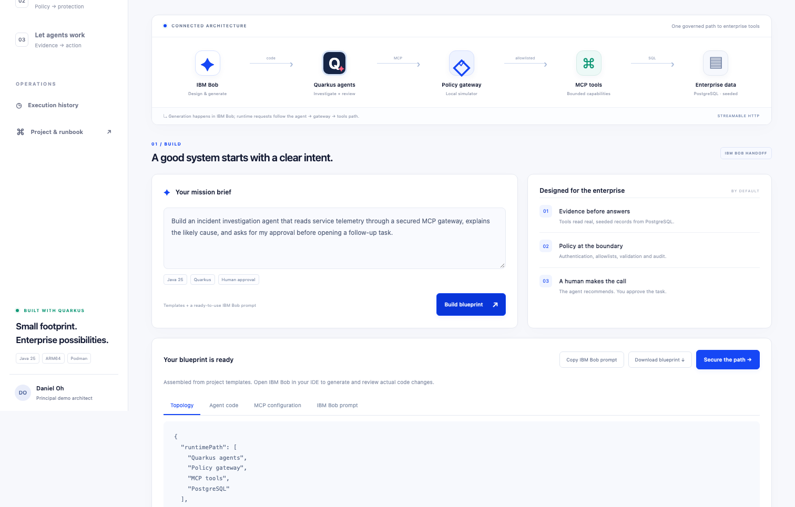
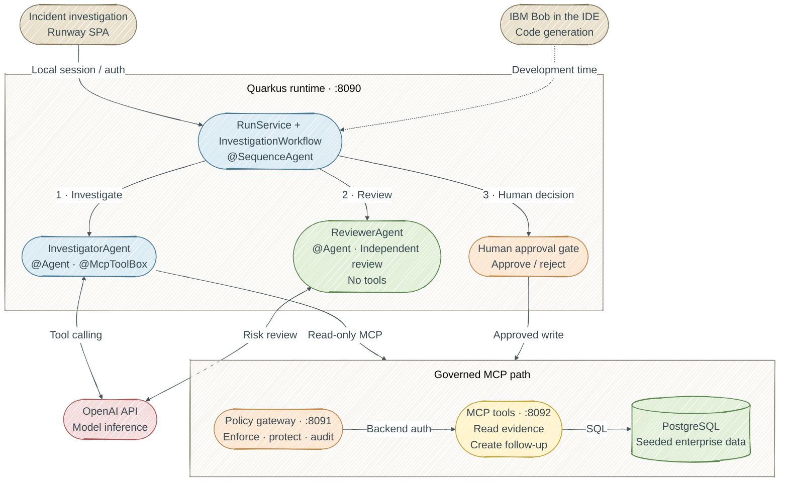

# Enterprise AI Runway

**From prompt to governed agent execution in 15 minutes.**

The SPA walks through the slide's three ideas: design with IBM Bob, secure MCP traffic at a gateway, and run Quarkus / LangChain4j agents against enterprise tools. An incident investigator reads PostgreSQL evidence; an independent reviewer checks its conclusions; a human decides whether to create a follow-up task.



## Start locally with Quarkus Dev Mode

Install a **JDK 25** and **Podman**, and configure an **OpenAI API key** for live AI. Maven is supplied by the checked-in wrapper. Bash, OpenSSL and Python 3 are used by the launcher and smoke checks. Node.js is needed only for optional UI tests.

```bash
# If Podman has not been initialized:
podman machine init --cpus 4 --memory 6144
podman machine start

# Set this in your local shell; never put the key in browser code or Git.
export OPENAI_API_KEY="your-api-key"

# In this project:
./demo.sh up
```

Leave this terminal open: `up` runs all three Quarkus applications in **Dev Mode** and streams their logs with service-name prefixes. Open **http://localhost:8090** when the launcher reports ready. The SPA connects automatically—no presenter key to copy. The browser receives a random runtime-session token; `.env` credentials, including `DEMO_API_KEY` and `OPENAI_API_KEY`, stay on the server. Reloading the page reconnects automatically.

Edit Java/resources and refresh the browser to trigger live reload. Finish an investigation before editing code: a reload can interrupt an active run and renew the browser session. Dev UI is available at **http://localhost:8090/q/dev-ui**. Debugger ports are 5005 (runtime), 5006 (gateway), and 5007 (tools). Interactive console menus and continuous testing are disabled so the three services can share the terminal; run tests separately when needed. **Ctrl+C** stops all three applications and PostgreSQL while preserving history. `./demo.sh down` does the same from another terminal.

To require manual entry locally, set `LOCAL_AUTO_CONNECT=false` in `.env` and restart. Retrieve the presenter key with `./demo.sh credentials`; it also remains available for scripts/API clients. The key or temporary session token is held only in browser memory, never local storage.

The launcher detects an SDKMAN current JDK when `JAVA_HOME` is unset. For a standard macOS JDK installation use `export JAVA_HOME=$(/usr/libexec/java_home -v 25)`. If Java 25 is installed elsewhere, set `JAVA_HOME` to that JDK. `./mvnw -version` must report Java 25.

The first start downloads Maven dependencies and the PostgreSQL container image. Allow 5–10 minutes **before** the presentation. The timed demo starts after the stack is ready. The three Quarkus applications run on the host; only PostgreSQL needs the Podman VM. OpenAI runs inference remotely, so no local model download or GPU allocation is needed. Live AI requires internet connectivity and API access; rehearse once before presenting.

All three HTTP services and the database’s dynamically assigned host port bind to `127.0.0.1`. The services share PostgreSQL in `runway-db`, backed by the persistent `runway-data` volume. When upgrading from the container launcher, `up` stops the old application containers and recreates the database container with a loopback port, retaining that volume. Packaged deployment references remain under `deploy/`; local Dev Mode does not exercise their container restrictions. Only the agent runtime receives `OPENAI_API_KEY`; it calls OpenAI over HTTPS. The key is never sent to the SPA, gateway or MCP tools.

## What is real in this demo?

| Component | Behavior |
|---|---|
| Agents | LangChain4j `@Agent` methods composed with `@SequenceAgent`. The investigator uses an MCP tool provider; the reviewer has no tools. |
| Enterprise data | Real PostgreSQL reads/writes with explicitly **seeded** incidents and telemetry. No connection to production systems. |
| Local gateway | A **Quarkus policy simulator**, not IBM DataPower. It enforces authentication, role-specific allowlists, argument validation, rate limits and persisted decision audit. |
| IBM Bob stage | The SPA assembles deterministic blueprint templates and a handoff prompt. Run that prompt in your actual IBM Bob IDE session for AI-generated code changes. The SPA does not claim to invoke Bob. |
| Live AI mode | Calls the configured model; there is no silent fallback to canned responses. Failures appear as failed runs. |
| Rehearsal mode | No model calls. Executes the real gateway, MCP tools, PostgreSQL and approval path, with an explicitly labeled deterministic report. |
| Kubernetes / DataPower | Deployment references and integration instructions are included. No cluster or IBM appliance is provisioned by the local launcher. |

This is a hardened, runnable reference application. An actual production deployment still requires your identity provider, TLS, secret management, least-privilege database accounts, shared rate limiting, backup/retention policies, model evaluation and the relevant IBM entitlement. See [production deployment](docs/production.md). It is not a claim of IBM certification or production accreditation.

## The 15-minute story

| Time | Action | Point to land |
|---|---|---|
| 0:00–1:00 | Open Runway, start the presenter timer, explain the topology. | There is one governed runtime path to tools. |
| 1:00–4:00 | Build a blueprint. Copy the prompt into IBM Bob; inspect one small code change and its test. | AI-assisted development begins with explicit architecture and constraints. |
| 4:00–7:00 | Open **Secure the path**. Run the 401, 403 and 400 probes and inspect the actual decision log. | Authentication, authorization and validation are independently enforced. |
| 7:00–11:00 | Select `INC-2042`, choose **Live AI**, start the investigation. Follow the trace and report. | Agents reason over real tool responses through MCP. |
| 11:00–13:00 | Approve the follow-up. Reopen the run from history. | Human authority and idempotent execution live outside the model. |
| 13:00–15:00 | Show the two Java agent interfaces and the MCP tool. Discuss the DataPower deployment path. | The same application boundary can sit behind enterprise controls. |

Detailed narration and recovery cues: [presenter runbook](docs/demo-runbook.md). A practical live coding prompt: [IBM Bob prompt](docs/ibm-bob-prompt.md).

## Architecture



The numbered branches show the workflow stages in order: investigation, independent review, then a human decision. The runtime also persists run state and approval records in PostgreSQL, and the gateway persists its decision audit there. The local policy gateway is a Quarkus simulator; IBM DataPower can replace that boundary using the [integration guide](deploy/datapower/README.md).

The runtime gathers three baseline evidence records before invoking the investigator, so the reviewer also receives independently collected observations. These baseline calls are distinguished from the agent's own dynamic calls in the execution trace. The gateway decision log contains both. Tool results and model output are treated as untrusted content and rendered as text in the SPA.

The Agentic API is declared in [InvestigatorAgent](agent-runtime/src/main/java/com/danieloh/demo/runtime/InvestigatorAgent.java), [ReviewerAgent](agent-runtime/src/main/java/com/danieloh/demo/runtime/ReviewerAgent.java), and [InvestigationWorkflow](agent-runtime/src/main/java/com/danieloh/demo/runtime/InvestigationWorkflow.java). Both agents use `@Agent`; `@SequenceAgent` invokes the investigator and then the reviewer, passing `finding` through a fresh `AgenticScope` and returning `report`. Independent baseline `evidence` is a separate workflow input. The Agentic extension registers the generated agents with application scope; no explicit CDI scope annotation is needed on the interfaces.

Tool limits are configured in `application.properties` using `quarkus.langchain4j.ai-service.max-tool-calling-round-trips=4` and `quarkus.langchain4j.ai-service.max-tool-calls-per-response=3`. The pinned extension's blocking execution path still reads the legacy `max-tool-executions` property, so it is set to reference the round-trip limit. Each agent uses `@ChatMemoryProviderSupplier` and `@MemoryId` to create its own in-memory conversation for each invocation, bounded to 32 messages. This memory ID is assigned by Agentic and is separate from the persisted run UUID. Only the investigator declares `@McpToolBox`, so the MCP integration supplies no tools to the reviewer.

[RunStageInterceptor](agent-runtime/src/main/java/com/danieloh/demo/runtime/RunStageInterceptor.java) checks persisted run status before and after each agent, records stage events, and evicts that agent's conversation in a `finally` block on success, failure, or cancellation. A timed-out or interrupted investigation cannot proceed to review. `RunService` owns the 150-second deadline, persistence, and approval endpoint. Human approval happens after the sequence returns and is required before the separate write credential can create a follow-up. Rehearsal mode bypasses the Agentic workflow and makes no model calls.

| Module | Responsibility | Local port |
|---|---|---|
| `agent-runtime` | SPA, API, two `@Agent` methods and their sequence, execution deadline, persisted history, human decisions | 8090 |
| `policy-gateway` | MCP request policy, credential separation, rate limiter, tool discovery filtering, audit | 8091 |
| `mcp-tools` | MCP tools, Flyway schema migrations, database-backed operations | 8092 |
| `shared` | Small JDBC and constant-time credential utilities | — |

MCP is **Streamable HTTP**, request/response subset; GET subsidiary streams and legacy SSE transport are not proxied. The server enables per-request auto-initialization for explicit orchestration/probe calls. The LangChain4j client also performs normal initialization. Both JSON and SSE-framed POST responses are handled. `tools/list` hides write tools from the investigator; the gateway still denies direct attempts to call them.

## Models and configuration

`./demo.sh init` generates independent random credentials into `.env` with mode 0600. `.env` and build outputs are ignored by Git. Start from `.env.example` only when supplying your own configuration. Never commit real credentials.

```properties
# Default .env settings; export OPENAI_API_KEY in your shell before startup.
LLM_BASE_URL=https://api.openai.com/v1
LLM_MODEL=gpt-4.1-mini
```

Both agents use **OpenAI by default**, through LangChain4j Chat Completions. [GPT-4.1 mini](https://developers.openai.com/api/docs/models/gpt-4.1-mini) supports function calling and suits the demo's short, bounded requests. Override `LLM_MODEL` to use another compatible model. Models with different temperature/reasoning requirements may need corresponding LangChain4j settings adjusted.

The launcher forwards the shell's `OPENAI_API_KEY` only to the runtime process. You may also store it in the ignored, mode-0600 `.env` for local development. Keep cloud keys on the server, following [OpenAI authentication guidance](https://developers.openai.com/api/reference/overview#authentication). Without a model credential, Rehearsal still works and Live AI returns a clear 503 setup error before creating a run. Invalid/revoked keys and provider errors fail visibly; no canned response is substituted.

For an optional native Ollama setup, run `ollama serve` and `ollama pull llama3.2:latest`, then change these settings in `.env`:

```properties
LLM_BASE_URL=http://localhost:11434/v1
LLM_MODEL=llama3.2:latest
LLM_API_KEY=ollama
```

`LLM_API_KEY` is an explicit override for other OpenAI-compatible providers and takes precedence over `OPENAI_API_KEY`. Remove that override when switching back to OpenAI, and restore the default base URL/model. Existing `.env` files are preserved by `init`; when upgrading from the original Ollama defaults, make these edits before restarting. The model must support tool calling. `ollama` is a local protocol placeholder. The availability indicator checks `/models`; providers that do not expose that endpoint may still work. It does not guarantee model quality or latency.

The investigator is bounded to four tool-calling rounds and three calls per response. Each provider request has a 35-second timeout; the provider's minimum retry setting is 1. Runs have a 150-second overall deadline and two active execution slots per runtime instance. The reviewer receives no tools, and neither agent retains conversation memory after its call completes. Expired/interrupted runs recover to failed status when read, and approvals recover against persisted follow-up records. There is no automatic retry of the whole agent workflow.

For higher-quality local answers, pre-pull a larger tool-capable model and rehearse it on your actual Mac before changing `LLM_MODEL`. Rehearsal mode remains available without a model or API key.

## Commands and verification

```bash
./demo.sh up                  # foreground Dev Mode, live reload and all service logs

# In another terminal, while up is running:
./demo.sh status              # dev launcher, service ports and database state
./demo.sh smoke               # optional rehearsal flow check, with real DB writes
SMOKE_MODE=live ./demo.sh smoke  # optional live model + full flow check
./demo.sh down                # stop dev processes and database; preserve data

./mvnw verify                # Java tests and all service packages
python3 -m unittest discover -s tests -p 'test_*.py'  # launcher lifecycle checks
npm ci                       # optional frontend test dependency
npx playwright install chromium
npm run test:access          # isolated browser authentication checks; no services needed
npm run test:ui              # requires running local stack and .env
```

Smoke checks are optional: Dev Mode compiles/reloads code, while smoke checks verify that the running services complete the whole demo flow together. They work with both dev and packaged services through HTTP. `up` does not run tests or smoke checks automatically. Logs stream in the `up` terminal and are also saved under the ignored `.run/` directory; there is no separate `logs` command. `--skip-build` is no longer needed or accepted.

Smoke/UI checks create seeded runs and follow-up tasks; they intentionally remain in history. Unit/API tests use mocks where appropriate; the smoke suite exercises the actual running services and PostgreSQL. Test cases include unauthorized API access, invalid input, tool escalation, JSON/SSE tool filtering, rate limiting, OIDC approval roles, concurrent approval, retries and rejection. Agentic integration tests exercise the generated sequence with a mocked model and a local MCP server, covering evidence handoff, reviewer tool isolation, tool-call limits, cancellation, and isolation between runs. Tests do not call a paid model by default.

The immutable `run_id` is also the unique key for the follow-up. A write requires a persisted approval timestamp and an eligible run state inside the MCP tool's SQL statement. A timeout after commit is reconciled by checking the database before retrying. The only supported write is creating a follow-up; there is no arbitrary SQL, shell command, restart or production remediation tool.

## API and observability

All `/api/*` routes require a bearer credential. For local browsing, the SPA automatically obtains a temporary session through `POST /local-session`; scripts can still use `Authorization: Bearer <DEMO_API_KEY>`. A session lasts for the runtime process and is renewed after restart. It never grants access when local auto-connect is disabled or OIDC is enabled.

Automatic connection is enabled in Quarkus Dev Mode, including `./demo.sh up`, which binds services to `127.0.0.1`. Packaged deployments default to disabled. The session endpoint requires a literal loopback hostname, a matching `Origin`, same-origin fetch metadata and the SPA's custom header; foreign origins are rejected. Keep this convenience limited to a trusted local machine, and never expose an enabled instance through a public proxy. Set `LOCAL_AUTO_CONNECT=false` for shared/deployed environments.

With OIDC enabled, tokens must have `groups: [presenter]`; approve/reject additionally require `approver`. OIDC always disables local-session issuance, even if the local flag is true. This is a shared presenter workspace, not a multi-tenant application.

| Method / path | Purpose |
|---|---|
| `POST /local-session` | Local-only, same-origin browser bootstrap; disabled for OIDC and normal packaged deployments |
| `GET /api/status` | Database/model readiness details and stale-run recovery |
| `GET /api/incidents` | Seeded incident choices |
| `POST /api/blueprint` | Generate template artifacts and IBM Bob handoff prompt |
| `POST /api/runs` | Start a live/rehearsal investigation; returns 202 + run ID |
| `GET /api/runs`, `GET /api/runs/{id}` | Persisted recent runs and execution details |
| `POST /api/runs/{id}/approve` | Record a human decision and create one follow-up |
| `POST /api/runs/{id}/reject` | Decline the recommendation |
| `POST /api/probes/{kind}` | `unauthorized`, `forbidden-tool`, `invalid-arguments` |
| `GET /api/audit`, `GET /api/followups` | Recent gateway decisions and tasks |
| `GET /q/health/live`, `/q/health/ready` | Quarkus health endpoints |
| `GET /q/metrics`, `/q/openapi` | Runtime Prometheus metrics / generated API schema |

Gateway metric: `runway_gateway_requests_total`, tagged only by decision and principal. Runtime metric: `runway_runs_completed_total`, tagged by mode. Gateway request IDs are included in HTTP responses and stored with decisions. An `ALLOW` audit row means the policy admitted the request; it is not proof the backend operation succeeded. The run result/follow-up record provides that confirmation. Prompt and tool payloads are not written to the gateway audit table; run prompts and final reports are persisted in `runs`.

## Troubleshooting

- **Java cannot be found:** set `JAVA_HOME` to a JDK 25, not macOS's `/usr/bin/java` launcher.
- **Podman cannot connect:** `podman machine start`; inspect `podman system connection list`. Existing unrelated containers are never stopped.
- **A service/debug port is occupied:** the launcher reports the conflicting port. Stop your previous demo with `./demo.sh down`, or stop the owning application before retrying. The launcher never kills processes based on port numbers.
- **Model not found / failed live run:** confirm `OPENAI_API_KEY` is exported before startup, API access/billing, the exact `LLM_MODEL` and the base URL. After changing credentials, stop the demo and run `./demo.sh up` again. For optional Ollama, check `ollama list`. Use rehearsal during the presentation if inference fails; it is labeled honestly.
- **429 after many probes/runs:** the gateway allows 60 requests per minute per principal. Wait for the next minute before retrying.
- **401 after restart:** local browser sessions renew automatically. Reload the page if a request raced with startup. In manual mode, re-copy `./demo.sh credentials`. If automatic connection is unavailable, use `localhost` directly and check `LOCAL_AUTO_CONNECT`; OIDC deployments require their configured identity provider.
- **Database login fails after editing `.env`:** the existing volume retains the original database password. Restore it or rotate the PostgreSQL role password explicitly; changing an environment variable does not rotate a database password.
- **Data reset:** data is retained intentionally. To start a clean dataset, stop/remove only this project's containers and explicitly remove `runway-data`; that deletes all demo history. `down` does not delete data.
- **Maven module-only dev launch cannot resolve `shared`:** `./demo.sh up` installs the shared library and parent automatically. For a manual launch, first run `./mvnw -pl shared -am install -DskipTests` from the root, then supply database URLs and credentials to each service.

## Daily dependency updates

[Dependabot](.github/dependabot.yml) checks Maven dependencies **every day at 06:00 America/New_York**, including weekends. Quarkus platform/core and Quarkiverse extensions (including LangChain4j and MCP Server) are grouped so related upgrades can be tested together. Patch, minor and major releases are eligible; incompatible groups remain open when verification fails.

[Automatic merging](.github/workflows/dependabot-automerge.yml) runs only after a successful **Verify** pull-request workflow for the PR's current commit. It verifies Dependabot ownership, the source repository/branch, and that every changed file is an existing `pom.xml`. The merge uses an exact commit guard to reject a newer, untested head. The privileged workflow never checks out PR code. Repository auto-merge and squash merging must be enabled (configured on `danieloh30/enterprise-ai-runway`). Existing branch protection requirements are respected.

These checks cover the Java tests, packaging and syntax validation in CI; a green build does not replace a live model/DataPower integration rehearsal. Review the next demo before presenting an upgraded stack.

## Version and reference notes

Quarkus **3.39.3** was the latest stable release verified on **2026-09-16**. PostgreSQL is pinned to the current 17.x patch, **17.11**. Extension versions are pinned: Quarkus LangChain4j **1.13.1**, MCP Server **2.0.1**. This project deliberately targets JVM Java 25; it does not claim a verified Java 25 native-image build. Container bases are multi-architecture and run natively as linux/arm64 on the M4. Pin approved image digests for a deployed release.

- [Quarkus releases](https://quarkus.io/releases/)
- [Quarkus LangChain4j MCP integration](https://docs.quarkiverse.io/quarkus-langchain4j/dev/mcp.html)
- [Quarkus LangChain4j Agentic API](https://docs.quarkiverse.io/quarkus-langchain4j/dev/agentic.html)
- [Quarkus MCP HTTP transport](https://docs.quarkiverse.io/quarkus-mcp-server/dev/getting-started-http.html)
- [Quarkus OIDC bearer authentication](https://quarkus.io/guides/security-oidc-bearer-token-authentication)
- [IBM DataPower Gateway containers](https://www.ibm.com/docs/en/datapower-gateway/11.0.0?topic=virtual-datapower-gateway-docker)

Author: **Daniel Oh** (`danieloh30`).
